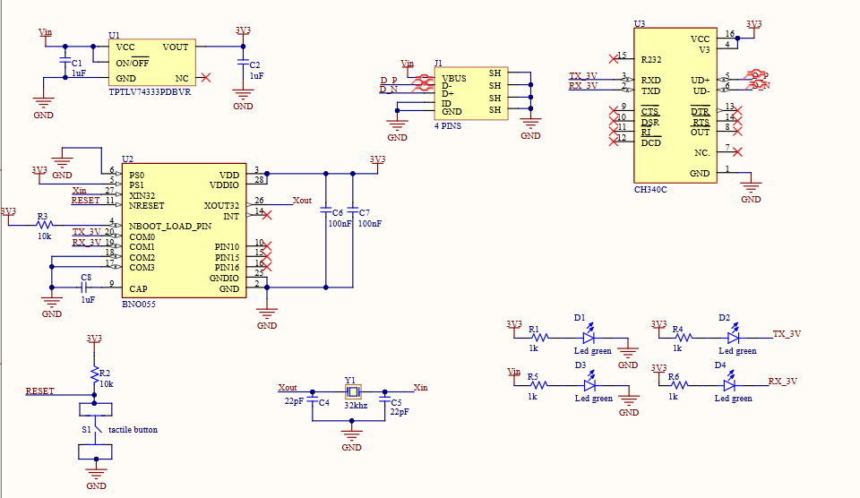
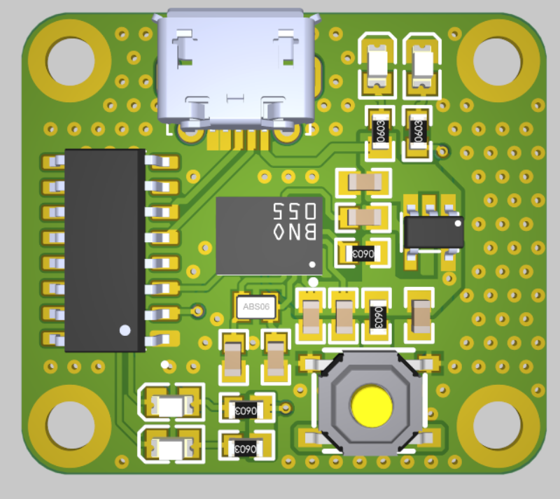

# BNO055 UART PCB Design

A custom PCB designed in Altium for interfacing with the BNO055 absolute orientation sensor using UART communication. The board connects to a PC via a USB-to-TTL converter, making it easy to prototype and integrate orientation sensing in embedded systems.

---

## 📌 Features

- **Sensor:** Bosch BNO055 (absolute orientation sensor with built-in sensor fusion)
- **Communication:** UART (TX/RX)
- **Host Interface:** USB-to-TTL serial adapter
- **Power Supply:** 3.3V regulated input
- **Design Tool:** Altium Designer
- **Board Features:**
  - Status LEDs
  - Decoupling capacitors
  - USB input header (4-pin)

---

## 🔍 About the BNO055

The **Bosch BNO055** is a sophisticated 9-axis absolute orientation sensor that integrates:

- A **3-axis accelerometer**
- A **3-axis gyroscope**
- A **3-axis magnetometer**

What sets the BNO055 apart is that it includes a **dedicated microcontroller** to perform **sensor fusion** internally. This means it can output high-level orientation data such as:

- **Euler angles** (heading, roll, pitch)
- **Quaternion rotation**
- **Gravity vector**
- **Linear acceleration**

...without requiring additional processing on your host MCU or PC.

This makes it ideal for:

- Robotics
- Motion tracking
- Gesture recognition
- Augmented/virtual reality applications

In this PCB design, the sensor communicates via **UART**, simplifying the interface with desktop applications or microcontrollers that lack I2C/SPI support or need reliable asynchronous communication.

---

## 🖼️ Project Images

### 🔧 Schematic Diagram  
  
*Replace with actual schematic image file*

### 🧱 3D PCB Render  
  
*Replace with actual 3D PCB render image*

---

## 📦 Component List (BOM Summary)

| Name       | Description                                     | Designators     | Qty |
|------------|-------------------------------------------------|-----------------|-----|
| 1uF        | 25V X7R ±10% 0603 MLCC                           | C1, C2, C8      | 3   |
| 22pF       | 50V C0G ±5% 0603 MLCC                            | C4, C5          | 2   |
| 100nF      | 50V X7R ±10% 0603 MLCC                           | C6, C7          | 2   |
| Green LED  | Emerald 0805 LEDs (RoHS)                        | D1, D2, D3, D4  | 4   |
| 4-Pin USB  | USB 2.0 Horizontal 5P Motherboard connector      | J1              | 1   |

---

## ⚙️ Setup & Usage

1. **Power the board** via USB-to-TTL dongle or external 3.3V supply.
2. **Connect to PC** using a USB-to-TTL converter:
   - TX (board) → RX (dongle)  
   - RX (board) → TX (dongle)  
   - GND ↔ GND
3. Open a serial terminal (e.g., PuTTY, Tera Term) at **115200 bps**.
4. Send UART commands according to the BNO055 protocol for configuration and data reading.

---

## 🧠 Design Notes

- Ensure UART signals are 3.3V logic — **no onboard level shifting**.
- Proper decoupling capacitors included for stable operation.
- Indicator LEDs show power and/or activity status.
- Compact and straightforward layout for breadboarding or enclosure mounting.

---

## 📄 Documentation

- [BNO055 Datasheet](https://www.bosch-sensortec.com/media/boschsensortec/downloads/datasheets/bst-bno055-ds000.pdf)
- [UART Protocol Guide (PDF)](https://cdn.sparkfun.com/assets/learn_tutorials/7/4/4/BST_BNO055_ApplicationsNote.pdf)

---

